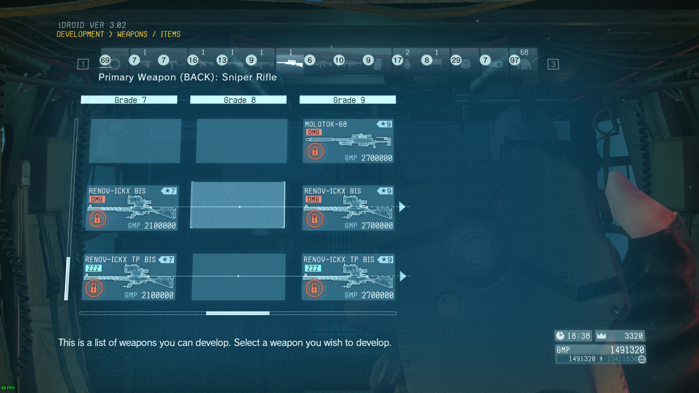
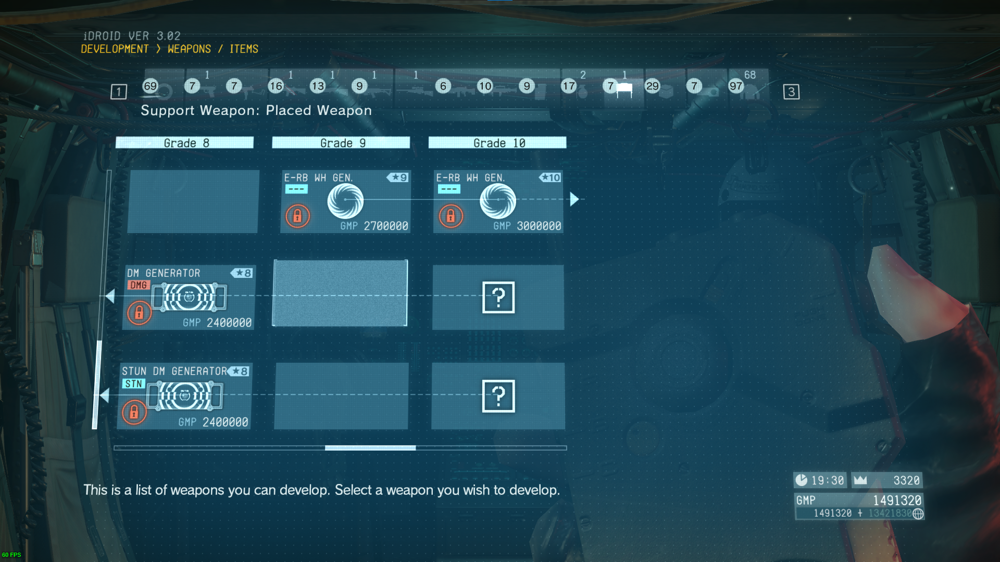

# Offline Development
This is a mod for [Metal Gear Solid V: The Phantom Pain](https://store.steampowered.com/app/287700/)

This mod requires [Zeta](https://www.nexusmods.com/metalgearsolidvtpp/mods/1309)

This mod enables online-only items for offline development and changes development requirements to better match an offline mode playthrough.

- All items have their level requirements changed to max out at level 61 for grade 15 gear, which is the level reached with 100 S-rank crew in each department.
- Items which don't normally have proper development requirements set by the game have been given ones costs calculated based on their equipment grade.
- All costs have been proportionally reduced to be accessible from offline mode without changing the relative cost progression
- All items now take 5 minutes per grade to develop starting at grade 2, to prevent progressing too quickly through the early development tree and to account for the lack of online development timers

